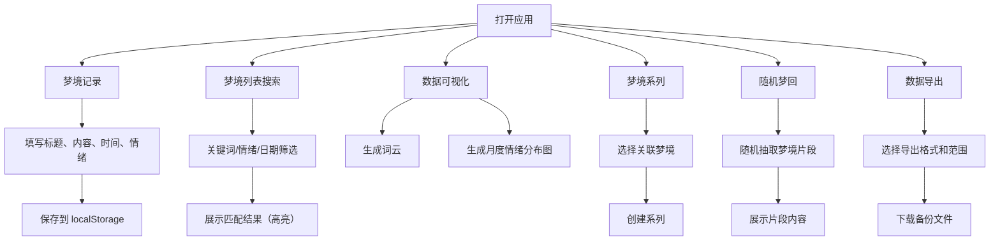

## 1. 产品概述

梦境日记是一款专注于记录和探索个人梦境世界的前端应用。用户可以在醒来后快速记录梦境细节，通过搜索和可视化功能深入了解自己的潜意识活动。所有数据本地存储，保护用户隐私。

- 核心价值：帮助用户捕捉转瞬即逝的梦境记忆，建立个人梦境档案，发现潜意识的规律和模式
- 目标用户：对梦境、心理学、自我探索感兴趣的普通用户
- 产品定位：轻量、隐私安全、富有探索性的个人梦境记录工具

## 2. 核心功能

### 2.1 用户角色

| 角色 | 注册方式 | 核心权限 |
|------|----------|----------|
| 普通用户 | 无需注册，本地存储 | 记录、搜索、查看、导出所有梦境数据 |

### 2.2 功能模块

1. **梦境记录页**：记录梦境标题、内容、醒来时间、睡眠时长、情绪感受
2. **梦境列表与搜索页**：梦境卡片列表，支持关键词、情绪、日期范围搜索，匹配内容高亮
3. **数据可视化页**：高频词云展示、月度情绪分布图
4. **梦境系列页**：手动关联相关梦境，创建梦境系列
5. **随机梦回页**：随机抽取一个梦境片段展示
6. **数据导出页**：将所有梦境导出为 Markdown/JSON 文档备份到本地

### 2.3 页面详情

| 页面名称 | 模块名称 | 功能描述 |
|----------|----------|----------|
| 梦境记录页 | 表单模块 | 输入梦境标题、富文本内容、醒来时间选择器、睡眠时长选择、情绪标签选择（开心/悲伤/恐惧/平静/兴奋/困惑等） |
| 梦境记录页 | 提交模块 | 保存梦境到本地存储，清空表单 |
| 梦境列表页 | 搜索模块 | 关键词输入框、情绪筛选下拉、日期范围选择器、搜索按钮、重置按钮 |
| 梦境列表页 | 梦境卡片 | 展示梦境标题、摘要、醒来时间、情绪标签，点击展开完整内容，匹配关键词高亮 |
| 数据可视化页 | 词云模块 | 自动从梦境内容提取高频词汇，生成交互式词云 |
| 数据可视化页 | 情绪分布图 | 月度情绪统计柱状图/饼图，展示不同情绪占比 |
| 梦境系列页 | 系列列表 | 展示已创建的梦境系列，可展开查看系列内梦境 |
| 梦境系列页 | 创建系列 | 选择多个梦境关联成系列，命名系列、添加描述 |
| 随机梦回页 | 随机抽取 | 随机从梦境库中抽取一个片段展示，带有神秘的过渡动画 |
| 随机梦回页 | 再抽一次 | 重新抽取另一个梦境片段 |
| 数据导出页 | 导出选项 | 选择导出格式（Markdown/JSON）、选择导出范围（全部/按时间范围） |
| 数据导出页 | 下载按钮 | 生成文件并触发浏览器下载 |

## 3. 核心流程

用户打开应用 → 选择记录梦境 → 填写梦境表单 → 保存到本地存储 → 可在列表中搜索查看 → 可查看词云和情绪分布 → 可创建梦境系列 → 可使用随机梦回功能 → 可导出数据备份

## 4. 用户界面设计

### 4.1 设计风格

- **主色调**：深紫色 (#1a0a2e) 作为背景，营造梦境神秘感；搭配柔和的粉紫色 (#9d4edd) 和淡蓝色 (#7b2cbf) 作为点缀
- **辅助色**：金色 (#ffd700) 用于高亮和重要按钮；不同情绪使用不同的柔和色调
- **按钮风格**：半透明玻璃拟态风格，带有柔和的光晕效果，圆角 12px
- **字体**：标题使用富有梦幻感的衬线字体（如 Playfair Display 或类似），正文使用现代无衬线字体
- **布局风格**：卡片式布局，带有磨砂玻璃效果和微妙的背景渐变
- **图标风格**：使用柔和的线性图标，配合梦境主题（月亮、星星、云朵等元素）
- **背景**：深色渐变背景，带有微妙的星空/星云纹理和光晕效果

### 4.2 页面设计概述

| 页面名称 | 模块名称 | UI 元素 |
|----------|----------|----------|
| 梦境记录页 | 表单模块 | 深色玻璃卡片，浮动标签输入框，日期时间选择器，情绪标签按钮组，带有微妙的悬停动效 |
| 梦境列表页 | 搜索模块 | 顶部搜索栏，筛选器折叠面板，搜索按钮带有发光效果 |
| 梦境列表页 | 梦境卡片 | 可展开卡片，显示标题、时间、情绪标签，展开时带有平滑过渡动画，关键词高亮使用金色背景 |
| 数据可视化页 | 词云模块 | 交互式词云，不同大小和颜色的词汇，悬停时显示出现次数，点击可搜索该词 |
| 数据可视化页 | 情绪分布图 | 优雅的环形图/柱状图，每种情绪对应独特的柔和色彩，带有数据标签 |
| 梦境系列页 | 系列列表 | 时间线风格布局，展示系列内梦境的关联关系，可拖拽调整顺序 |
| 随机梦回页 | 随机抽取 | 中央展示卡片，带有神秘的渐变边框和光晕效果，切换时有淡入淡出动画 |
| 导航栏 | 主导航 | 顶部或侧边导航，带有梦幻的发光图标，当前页高亮 |

### 4.3 响应式

- **桌面端**：侧边导航 + 主内容区布局，卡片可多列展示
- **平板端**：顶部导航，卡片两列布局
- **移动端**：底部导航栏，卡片单列布局，优化触摸交互
- 所有交互元素确保足够的触摸区域（最小 44x44px）

### 4.4 动画与交互

- 页面加载时使用淡入和轻微上浮的入场动画
- 卡片悬停时轻微上浮并增强光晕效果
- 情绪标签点击时有缩放和颜色变化动效
- 随机梦回功能使用渐变和模糊的过渡效果
- 搜索匹配结果使用闪烁高亮效果引导注意力
- 所有过渡动画使用缓动曲线，时长 300-500ms
