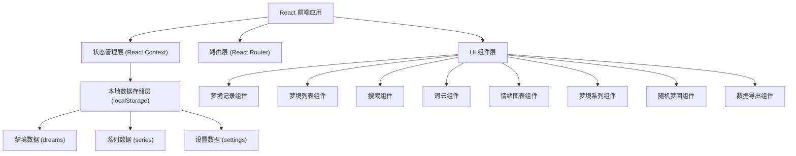
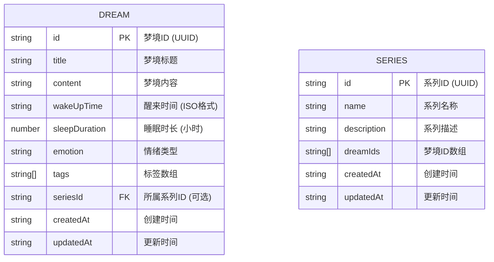

## 1. 架构设计



## 2. 技术描述

- **前端框架**：React@18 + TypeScript
- **构建工具**：Vite@5
- **样式方案**：TailwindCSS@3 + 自定义 CSS 变量
- **路由管理**：React Router DOM@6
- **图表库**：recharts@2（用于情绪分布图）
- **词云库**：react-d3-cloud（或自定义 canvas 实现）
- **图标库**：lucide-react（线性图标，支持梦境主题）
- **数据存储**：浏览器 localStorage（数据不上传，完全本地）
- **状态管理**：React Context + useReducer（轻量级状态管理）
- **日期处理**：date-fns（轻量级日期工具库）

## 3. 路由定义

| 路由 | 页面名称 | 功能描述 |
|------|----------|----------|
| / | 首页 | 应用入口，展示快捷操作入口和最近梦境 |
| /record | 梦境记录 | 创建新梦境记录 |
| /dreams | 梦境列表 | 展示所有梦境，支持搜索筛选 |
| /dreams/:id | 梦境详情 | 查看单个梦境的完整内容 |
| /visualize | 数据可视化 | 词云和情绪分布图 |
| /series | 梦境系列 | 梦境系列列表和管理 |
| /series/:id | 系列详情 | 查看系列内的所有关联梦境 |
| /reverie | 随机梦回 | 随机展示梦境片段 |
| /export | 数据导出 | 导出梦境数据备份 |

## 4. 数据模型

### 4.1 数据模型定义



### 4.2 TypeScript 类型定义

```typescript
// 情绪类型
type EmotionType = 'happy' | 'sad' | 'fear' | 'calm' | 'excited' | 'confused' | 'angry' | 'peaceful';

// 梦境数据接口
interface Dream {
  id: string;
  title: string;
  content: string;
  wakeUpTime: string; // ISO 8601
  sleepDuration: number; // 小时
  emotion: EmotionType;
  tags: string[];
  seriesId?: string;
  createdAt: string;
  updatedAt: string;
}

// 梦境系列接口
interface Series {
  id: string;
  name: string;
  description: string;
  dreamIds: string[];
  createdAt: string;
  updatedAt: string;
}

// 搜索筛选接口
interface SearchFilters {
  keyword: string;
  emotion?: EmotionType;
  startDate?: string;
  endDate?: string;
}

// 词云数据接口
interface WordCloudItem {
  text: string;
  value: number;
}

// 情绪统计接口
interface EmotionStat {
  emotion: EmotionType;
  count: number;
  percentage: number;
}

// 导出格式类型
type ExportFormat = 'markdown' | 'json';
```

### 4.3 存储键定义

- `dream_diary_dreams` - 存储所有梦境记录数组
- `dream_diary_series` - 存储所有梦境系列数组
- `dream_diary_settings` - 存储用户设置

## 5. 核心功能模块实现说明

### 5.1 搜索与高亮

- 使用 `Array.filter()` 结合多条件筛选
- 关键词匹配使用正则表达式，忽略大小写
- 高亮使用 `<mark>` 标签，配合 CSS 样式
- 支持同时搜索标题、内容、标签

### 5.2 词云生成

- 分词：使用简单的中文分词（按标点和空格分割，可结合常用词库）
- 停用词过滤：过滤常见无意义词汇（的、了、是等）
- 词频统计：统计词汇出现频率
- 词云渲染：使用 canvas 或 SVG 渲染，根据词频调整字体大小和颜色

### 5.3 情绪分布图

- 按月统计各情绪类型的梦境数量
- 使用 recharts 生成环形图和柱状图
- 支持切换查看不同月份的数据

### 5.4 梦境系列管理

- 支持多选梦境创建系列
- 支持添加/移除系列中的梦境
- 支持编辑系列名称和描述
- 系列内梦境按时间排序展示

### 5.5 随机梦回

- 从所有梦境中随机选择一个
- 截取内容的随机片段（50-100字）
- 添加神秘的过渡动画效果
- 支持"再抽一次"功能

### 5.6 数据导出

- **Markdown 格式**：每个梦境生成独立的 Markdown 章节，包含元数据和内容
- **JSON 格式**：导出完整的结构化数据
- 支持按时间范围筛选导出
- 使用 Blob 和 URL.createObjectURL() 实现浏览器下载

## 6. 项目目录结构

```
src/
├── components/          # 通用组件
│   ├── Layout.tsx       # 布局组件（导航栏+内容区）
│   ├── DreamCard.tsx    # 梦境卡片组件
│   ├── EmotionTag.tsx   # 情绪标签组件
│   ├── SearchBar.tsx    # 搜索栏组件
│   └── GlassCard.tsx    # 玻璃效果卡片
├── pages/               # 页面组件
│   ├── Home.tsx
│   ├── RecordDream.tsx
│   ├── DreamList.tsx
│   ├── DreamDetail.tsx
│   ├── Visualize.tsx
│   ├── SeriesList.tsx
│   ├── SeriesDetail.tsx
│   ├── RandomReverie.tsx
│   └── Export.tsx
├── context/             # 状态管理
│   └── DreamContext.tsx
├── hooks/               # 自定义 Hooks
│   ├── useDreams.ts
│   ├── useSearch.ts
│   ├── useWordCloud.ts
│   └── useEmotionStats.ts
├── utils/               # 工具函数
│   ├── storage.ts       # localStorage 封装
│   ├── wordAnalysis.ts  # 分词和词频统计
│   ├── export.ts        # 导出功能
│   └── date.ts          # 日期处理
├── types/               # TypeScript 类型定义
│   └── index.ts
├── App.tsx              # 应用入口
├── main.tsx             # React 入口
└── index.css            # 全局样式和 Tailwind
```
